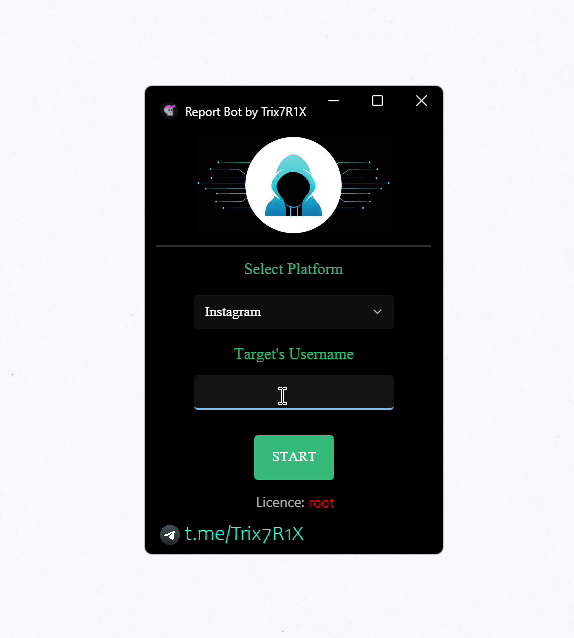

# TikTok-Report-Bot-2024
⚡ PREMIUM PRIVATE TOOL ⚡

  
  <h2>SM Report Bot</h2>
  

    It was developed and tested by a professional developer for 2 year and presented to you.
     
  

  ---

  
 <!-- Center-align the content under "🔥 Features 🔥" -->
    <h1>🔥 Features 🔥</h1>
    <ul style="list-style-type: none; padding: 0; text-align: left;">
      <li>Daily mass reports limit: Unlimited</li>
      <li>Proxies: Unlimited and automatic proxy, you do not need to take any action.</li>
      <li>Accounts: This is automatic, the tool will use accounts for reporting your target from our database API, you do not need to take any action.</li>
      <li>Access: You can access our Tool with the license granted to you after purchase. (NO DOWNLOADS) accessible through our private website panel. (Optional).</li>
      <li>Our tool works on all operating systems, we also have Android/IOS version (<a href="https://t.me/Trix7R1Xchannel/15" target="_blank">Announcement</a>). All you have to do is enter the username of the target and press Start.</li>
    </ul>
  

  ---

  

    ⭐ Join our channel <a href="https://t.me/Trix7R1Xchannel">BY CLICKING HERE</a> to get news about updates and important notifications related to our tool.  
    ⭐ You can access the Tool <a href="https://t.me/Trix7R1X_Bot">HERE.</a>
  

Preview:  
https://www.youtube.com/watch?v=74cUbDoF72Y

  <h1>DISCLAIMER</h1>
  

    THIS REPO/PROJECT IS ONLY FOR EDUCATIONAL PURPOSES, DON'T USE IT IN MALICIOUS WAYS AGAINST SOMEONE ELSE.
  

